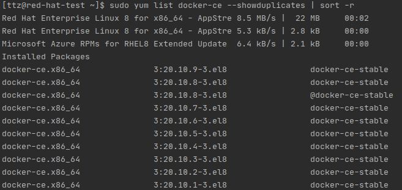

# fabric-installation-app
This is a full-stack app that utilizes to build a [Hyperledger Fabric](https://www.hyperledger.org/use/fabric) network in
the local environment. System consists of three components;
* **Client/:** This is a [Vue.js](https://vuejs.org/) web app that enables admins to easly manage the network using a GUI.
* **Common/:** This package contains the fabric specific functions.
* **Server/:** This package brings together the functions in the `Common/` package in a way that enables admins to build
fabric network.

## Prerequisites 
#### Operating System
**Linux** is the OS that this app should be running on since `Common/` package's main logic is running Hyperledger 
Fabric's linux binaries as child processes and then acting upon stout/sterr outputs. Tested Linux distros;
* [Ubuntu 18.04 - 20.04](https://ubuntu.com/)
* [Red Hat Enterprise Linux v8](https://access.redhat.com/documentation/en-us/red_hat_enterprise_linux/8) 
 
> Since the tests are only done with above Operating Systems, rest of the commands for installing remaining prerequisites
> are only for Ubuntu and Red Hat Linux.

#### Nodejs 14 LTS
##### Ubuntu
```shell script
curl -fsSL https://deb.nodesource.com/setup_14.x | sudo -E bash -
```
then

```shell script
sudo apt-get install -y nodejs
```

##### Red Hat Enterprise Linux
```shell script
curl -sL https://rpm.nodesource.com/setup_14.x | sudo bash -
```
then
```shell script
sudo yum install -y nodejs
```
#### pm2
The command for installin `pm2` is the same for Ubuntu and RHEL.
```shell script
sudo npm install pm2 -g
```
#### nginx
##### Ubuntu
```shell script
sudo apt install nginx
```
##### Red Hat Enterprise Linux
```shell script
sudo yum install nginx
```
#### Docker
fabric-installation-app uses [Docker Engine API v1.40](https://docs.docker.com/engine/api/v1.40/) and
Docker Engine API v1.40 is supported for the Docker versions > 19.03.
##### Ubuntu 
```shell script
sudo apt-get update
```
```shell script
sudo apt-get install apt-transport-https ca-certificates curl gnupg lsb-release
```
```shell script
curl -fsSL https://download.docker.com/linux/ubuntu/gpg | sudo gpg --dearmor -o /usr/share/keyrings/docker-archive-keyring.gpg
```
```shell script
echo "deb [arch=$(dpkg --print-architecture) signed-by=/usr/share/keyrings/docker-archive-keyring.gpg] https://download.docker.com/linux/ubuntu $(lsb_release -cs) stable" | sudo tee /etc/apt/sources.list.d/docker.list > /dev/null
```
```shell script
sudo apt-get update 
```
```shell script
apt-cache madison docker-ce 
```

You should something like below this


Select the version you wish to install and run the command like this

```shell script
sudo apt-get install docker-ce=5:20.10.8~3-0~ubuntu-focal docker-ce-cli=5:20.10.8~3-0~ubuntu-focal containerd.io
```

```shell script
sudo docker -v
```
```shell script
sudo groupadd docker
```
```shell script
sudo usermod -aG docker $USER
```
```shell script
newgrp docker
```

##### Red Hat Enterprise Linux
```shell script
sudo yum install -y yum-utils
```
```shell script
sudo yum-config-manager --add-repo https://download.docker.com/linux/centos/docker-ce.repo
```
```shell script
sudo yum list docker-ce --showduplicates | sort -r 
```

You should see something like below



And to install Docker 20.10.8 use the below command

```shell script
sudo yum install docker-ce-20.10.8 docker-ce-cli-20.10.8 containerd.io
```

```shell script
sudo systemctl start docker
```
```shell script
sudo docker -v
```
```shell script
sudo groupadd docker
```
```shell script
sudo usermod -aG docker $USER 
```
```shell script
newgrp docker
```

#### Docker Engine API Test
In order for the app to successfully operate, we need to make sure Docker Engine API is working smoothly. Below are the 
commands to run the test script for Docker Engine API;

```shell script
cd fabric-installation-app/
```
```shell script
npm install Common/
```

```shell script
docker pull hello-world
```

```shell script
pm2 start --only docker-check
```

```shell script
pm2 logs docker-check --lines 1000 --nostream
```

Check the logs and make sure everything is working. Below the last a few lines of a successful execution;


###### Troubleshoot
If you run into any problems please make sure you follow the steps below first and then try again the 
Docker Engine API Test

```shell script
sudo systemctl enable docker
```
```shell script
sudo systemctl disable docker 
```
```shell script
reboot
```
Below step is not necessary for Ubuntu but is a must for RHEL
```shell script
sudo systemctl start docker
```

#### Google Chrome
##### Ubuntu 
```shell script
wget https://dl.google.com/linux/direct/google-chrome-stable_current_amd64.deb
```
```shell script
sudo apt install ./google-chrome-stable_current_amd64.deb 
```
##### Red Hat Enterprise Linux 
```shell script
wget https://dl.google.com/linux/direct/google-chrome-stable_current_x86_64.rpm
```
```shell script
sudo yum install ./google-chrome-stable_current_x86_64.rpm
```

#### Pull Below Images
```shell script
sudo docker pull hyperledger/fabric-ca:1.4.9 
sudo docker pull hyperledger/fabric-peer:2.3 
sudo docker pull hyperledger/fabric-orderer:2.3 
sudo docker pull hyperledger/fabric-tools:2.3 
sudo docker pull hyperledger/fabric-ccenv:2.3 
sudo docker pull hyperledger/fabric-nodeenv:2.3 
sudo docker pull hyperledger/fabric-couchdb:latest 
sudo docker pull postgres:latest 
```
#### Hyperledger Fabric Binaries
```shell script
mkdir  ~/fabric 
cd ~/fabric
```
##### Hyperledger Fabric 2.3.1 
```shell script
wget https://github.com/hyperledger/fabric/releases/download/v2.3.1/hyperledger-fabric-linux-amd64-2.3.1.tar.gz
```
```shell script
tar -xvf hyperledger-fabric-linux-amd64-2.3.1.tar.gz
```
##### Hyperledger Fabric CA 1.4.9 
```shell script
wget https://github.com/hyperledger/fabric-ca/releases/download/v1.4.9/hyperledger-fabric-ca-linux-amd64-1.4.9.tar.gz
```
```shell script
tar -xvf hyperledger-fabric-ca-linux-amd64-1.4.9.tar.gz 
```
Add to path
```shell script
sudo cp bin/* /bin
```
Test
```shell script
peer version
```

Expexted Output 


## Running The App
